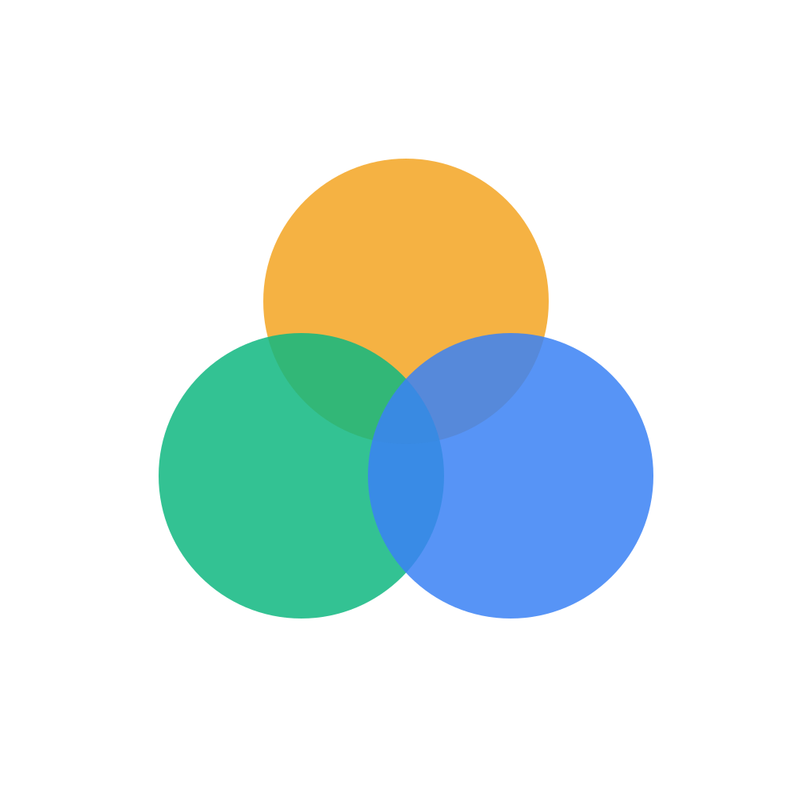

<p align="center">
  
</p>

<h1 align="center">Hayat (حياة)</h1>

<p align="center">
  A gesture-driven life balance tracker rooted in Islamic well-being principles and CBT.
</p>

<p align="center">
  
  
  
  
</p>

---

## What is Hayat?

Hayat is a mobile app that helps you track daily actions across three life pillars:

- **Afterlife** — spiritual growth (prayer, Quran, dhikr, charity)
- **Self** — personal development (health, learning, rest, discipline)
- **Others** — relationships (family, friends, community, kindness)

You log actions by swiping joystick controls — no typing, no menus. Each swipe maps to a direction (positive/negative, direct/indirect) inspired by Cognitive Behavioral Therapy. Hold the joystick to pick a specific target.

The app gives you analytics (charts, trends, comparisons) and a unique physics-based body-fill visualization where balls fill a human silhouette to show your life balance at a glance.

## Features

- **Joystick logging** — Swipe in 4 directions per pillar to log actions in under 2 seconds
- **Hold-to-target** — Long press to select a specific goal/target for precise tracking
- **Analytics dashboard** — Bar charts, donut charts, trend lines, period comparisons
- **Body-fill visualization** — Physics simulation (Matter.js + Skia) fills a body silhouette with colored balls
- **Goal management** — Create, archive, and track targets per pillar with lifecycle management
- **Privacy mode** — Targets get funny codenames; reveal real names with a PIN
- **Backup & restore** — Export/import all data as JSON
- **Notifications** — Daily and weekly review reminders
- **Onboarding** — Guided tutorial explaining the 3 pillars and gesture system
- **Dark mode** — Dark theme only, minimalist design with Inter font

## Tech Stack

| Layer | Technology |
|-------|-----------|
| **Framework** | [React Native](https://reactnative.dev/) 0.83 + [Expo](https://expo.dev/) 55 |
| **Language** | TypeScript 5.9 |
| **Navigation** | Expo Router (file-based) |
| **Gestures** | React Native Gesture Handler v2 + Reanimated v3 |
| **Physics** | [Matter.js](https://brm.io/matter-js/) + [@shopify/react-native-skia](https://shopify.github.io/react-native-skia/) |
| **Database** | Expo SQLite (local-only) |
| **State** | [Zustand](https://zustand-demo.pmnd.rs/) + [MMKV](https://github.com/mrousavy/react-native-mmkv) |
| **Fonts** | [Inter](https://rsms.me/inter/) via @expo-google-fonts |
| **Notifications** | expo-notifications (local triggers) |

## Project Structure

```
app/
  (tabs)/
    index.tsx          # Home — joystick controls + today's log
    analytics.tsx      # Charts, trends, period comparison
    goals.tsx          # Target management per pillar
    settings.tsx       # Reminders, privacy, backup/restore
  body-fill.tsx        # Physics body-fill visualization
  onboarding.tsx       # First-launch tutorial
src/
  components/          # UI components (joystick, charts, modals)
  constants/           # Theme, colors, pillar definitions
  database/            # SQLite schema, migrations, queries
  services/            # Business logic (analytics, backup, notifications)
  stores/              # Zustand stores (logs, goals, settings)
  types/               # TypeScript type definitions
  utils/               # Helpers (date formatting, codename generation)
assets/                # App icon, splash screen
```

## Getting Started

### Prerequisites

- [Node.js](https://nodejs.org/) 18+
- [Expo CLI](https://docs.expo.dev/get-started/installation/)
- iOS Simulator (macOS) or Android Emulator, or a physical device with [Expo Go](https://expo.dev/go)

### Installation

```bash
# Clone the repository
git clone https://github.com/DevAbdoTolba/life.git
cd life

# Install dependencies
npm install

# Start the development server
npx expo start
```

### Running on a device

After `npx expo start`, you can:

- **Scan the QR code** with Expo Go (Android) or Camera app (iOS)
- Press `a` to open on Android emulator
- Press `i` to open on iOS simulator
- Press `w` to open in web browser (limited support)

### Building for production

```bash
# Install EAS CLI
npm install -g eas-cli

# Build for Android
eas build --platform android

# Build for iOS
eas build --platform ios
```

## How It Works

1. **Open the app** — You see 3 joysticks arranged in a triangle (Afterlife on top, Self and Others on bottom)
2. **Swipe a joystick** — Each direction logs a different type of action:
   - Up = positive direct
   - Down = negative direct
   - Left = negative indirect
   - Right = positive indirect
3. **Hold to target** — Long press reveals your custom targets for that pillar, swipe to log against a specific one
4. **Check analytics** — Switch to the Analytics tab for charts, trends, and the body-fill visualization
5. **Manage goals** — Use the Goals tab to create and organize tracking targets

## Privacy

All data stays on your device. No accounts, no cloud sync, no telemetry. You can export a JSON backup anytime from Settings.

---

Built with care by [@DevAbdoTolba](https://github.com/DevAbdoTolba)
